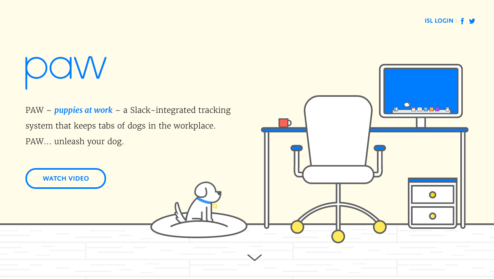

[](https://waffle.io/istrategylabs/paw)

# PAW: Puppies at Work



## Up-and-running

To start the API server:

```
npm run start
```

To start the API server with [Nodemon](https://github.com/remy/nodemon) + [Browsersync](https://github.com/Browsersync/browser-sync) server:

```
npm run dev
```

or to build, cachebust, and minify all assets for production:

```
npm run build
```

## Configuration

Application config lives in `config.js` and uses [nconf](https://github.com/indexzero/nconf).
The same configuration is shipped with node and the browser.

### Node

In Node, require the file then use nconf to get a config value by name:

```
var config = require('./config');
var TOKEN = config.get('ISL_API_TOKEN');
```

In Browserify, we load the nconf configuration with [envify](https://github.com/hughsk/envify/). Refer to your config value through `process.env`:

```
setInterval(function() {
  fetch();
}, process.env.DOG_POLLING_INTERVAL_MS);
```
